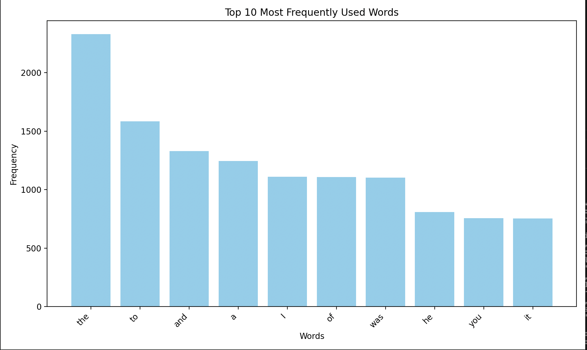

# goit-cs-hw-05

### Computer Systems and Their Fundamentals

### Master of degree from university


### Task 2 chart
### for text from resource 
`https://gutenberg.net.au/ebooks05/0500781.txt`
```
